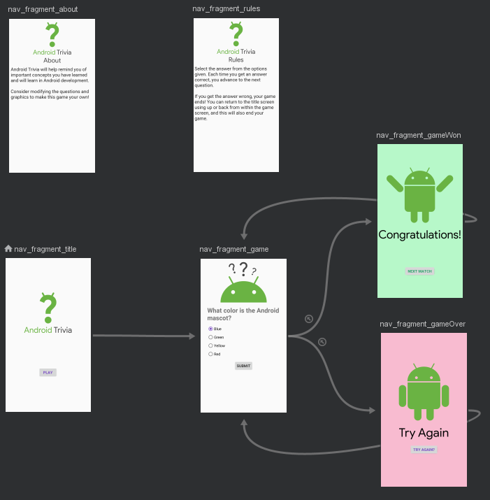
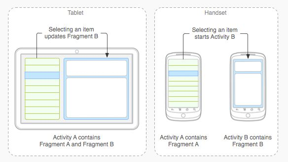
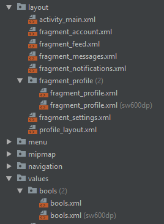

# Questions about course videos?

# Lesson contents

## Navigation Graph: navigation made easy



## SafeArgs: when Fragments need arguments

```
<fragment
    android:id="@+id/nav_fragment_gameWon"
    android:name="com.example.android.navigation.GameWonFragment"
    android:label="fragment_game_won"
    tools:layout="@layout/fragment_game_won">
    <action
        android:id="@+id/action_nav_fragment_gameWon_to_nav_fragment_game"
        app:destination="@id/nav_fragment_game"
        app:enterAnim="@anim/slide_in_left"
        app:exitAnim="@anim/slide_out_right"
        app:popEnterAnim="@anim/slide_in_right"
        app:popExitAnim="@anim/slide_out_left"
        app:popUpTo="@+id/nav_fragment_title"
        app:popUpToInclusive="false" />
    <argument
        android:name="numQuestions"
        app:argType="integer" />
    <argument
        android:name="numCorrect"
        app:argType="integer" />
</fragment>
```

# Changes from course solution

* [https://github.com/Native-Apps-Android-HOGENT/Lesson-3-App-Navigation](https://github.com/Native-Apps-Android-HOGENT/Lesson-3-App-Navigation)
    * Espresso Tests
    * IDs in layout in accordance with naming conventions

# Extra: Dual Pane layouts



## How?

* [Master-Detail views with Navigation Components](https://proandroiddev.com/master-detail-views-with-navigation-components-a20405f31974) by Lara Martin
* [https://github.com/Native-Apps-Android-HOGENT/Lesson-3-Extra-Master-Detail-Layout](https://github.com/Native-Apps-Android-HOGENT/Lesson-3-Extra-Master-Detail-Layout)

## Components of a Dual Pane Layout

### Two layout files for each layout (different qualifiers)


### Two NavControllers

* One for the main navigation (as normal)
    * _Navigate_ to correct Fragment
* One for screens using a dual pane layout
    * Only used when in dual pane mode (on tablets)
    * _Show_ correct Fragment

### Code that builds layout differently depending on current configuration
```
if (context!!.resources.getBoolean(R.bool.isTablet)) {
        displayMasterDetailLayout()
    } else {
        displaySingleLayout()
    }
}
```

---

```

private fun displaySingleLayout() {
    binding.profileLayout.accountTextView.setOnClickListener(
        Navigation.createNavigateOnClickListener(R.id.action_profile_fragment_to_fragment_account)
    )
    binding.profileLayout.notificationsTextView.setOnClickListener(
        Navigation.createNavigateOnClickListener(R.id.action_profile_fragment_to_fragment_notifications)
    )
    binding.profileLayout.settingsTextView.setOnClickListener(
        Navigation.createNavigateOnClickListener(R.id.action_profile_fragment_to_fragment_settings)
    )
}

private fun displayMasterDetailLayout() {
    val detailNavHost =
        childFragmentManager.findFragmentById(R.id.profile_nav_container) as NavHostFragment

    binding.profileLayout.accountTextView.setOnClickListener {
        detailNavHost.navController.navigate(R.id.fragment_account)
    }

    binding.profileLayout.notificationsTextView.setOnClickListener {
        detailNavHost.navController.navigate(R.id.fragment_notifications)
    }

    binding.profileLayout.settingsTextView.setOnClickListener {
        detailNavHost.navController.navigate(R.id.fragment_settings)
    }
}
```

# Exercise: refactor the Quiz app

Currently no unit tests can be written, even though there is plenty of business logic in the app.
Refactor the app so that all business logic is moved out of the Fragments. 

TDD! First write tests as what you expect your refactor to do, then write the code. 

